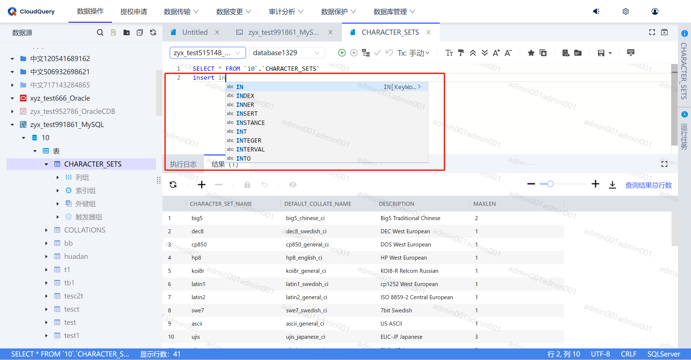
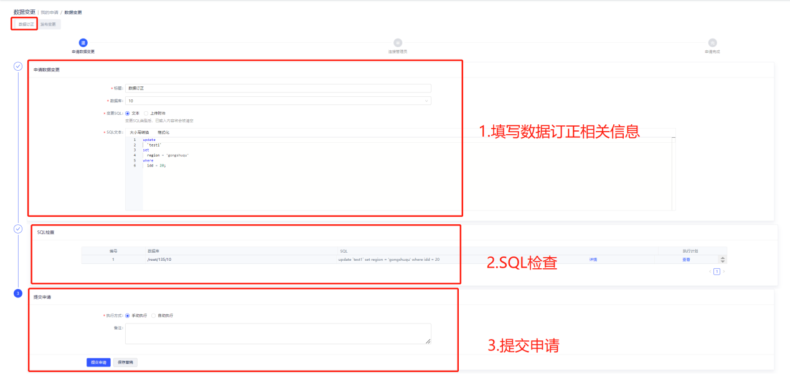
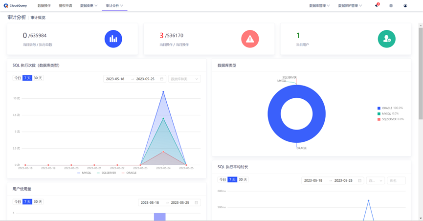
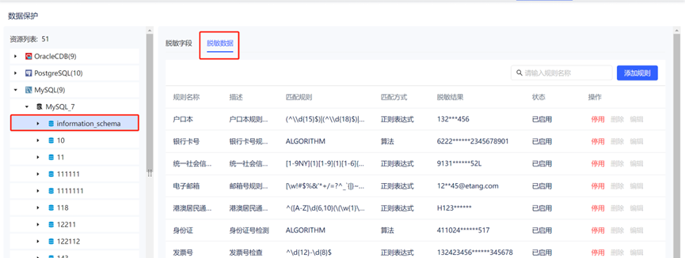
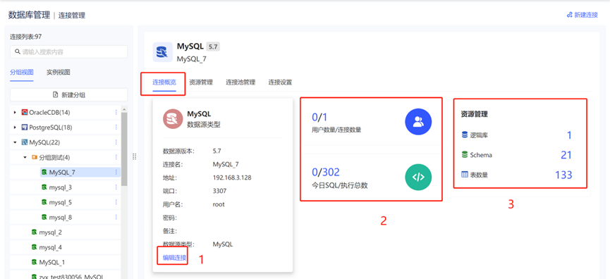

<h1 align="center">CloudQuery</h1>

# CloudQuery 数据库安全管控平台

作为业界领先的面向企业的数据库安全解决方案，CloudQuery致力于打造一站式安全可靠的数据操作平台，旨在帮助企业安全、高效地使用数据库，提升研发与DBA、运维的协作效率，为企业核心数据提供更安全的访问管控与审计，防止数据越权访问、数据泄漏、数据误删除等。

**[产品官网](https://cloudquery.club/)**  

**[在线体验](https://cloudquery.club/](http://122.112.167.91/system_data_operate)**  

**[使用文档](https://bintools.yuque.com/org-wiki-bintools-xniowl/do4ums)**

**[下载地址](https://cloudquery.club/#/download)**

## 功能介绍

- 数据查询

- 数据源支持（Oracle、MySQL、PostgreSQL、SQLServer、PolarDB、OpenGauss、达梦、MongoDB、Redis、OceanBase、StarRocks、ClickHouse、TiDB、TelePG、人大金仓）

- 数据导出管控（导出脱敏、后台任务）

- SQL智能补全提示、错误提示

- 细粒度权限管控（schema级、表级、列级、行级等）

- 受保护数据动态脱敏

- 行级数据安全控制

- 全链路操作审计告警

- 生产环境数据发布变更

- 数据传输

- 静态脱敏

- 数据订正

- 提权审批

- 数据库原生终端工具

- 支持自定义审批流程

- 第三方登陆（OAuth2、LDAP、AD等）

- 高可用、分布式部署（支持单机、多机、K8S、云环境部署）

## 效果展示

- 数据查询、智能提示

- 流程设计

- 数据订正

- 审计分析

- 数据脱敏

- 连接管理

## 更多功能

了解CloudQuery更多详细功能介绍，请访问**[操作手册](https://bintools.yuque.com/org-wiki-bintools-xniowl/do4ums/sgdw8wwovqn22dn5)**

## 技术支持
CloudQuery社区交流     
WeChat: m_buwangchuxin   

扫描二维码，添加小助手后拉您进群

## 联系我们
商务：151 7223 4427  
电话：0571-56182295  
邮箱：my.huang@bintools.cn  

